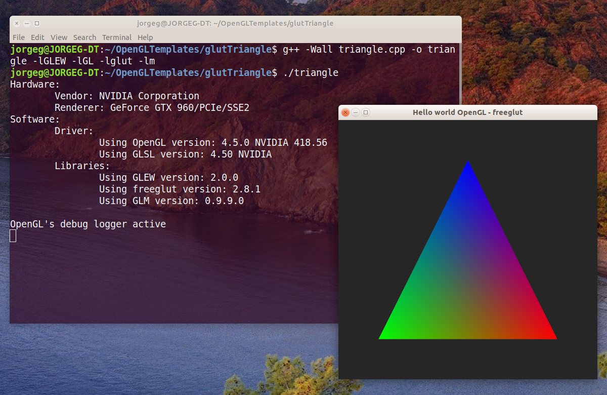

# OpenGL template

A minimal working example of an OpenGL program using [GLEW](http://glew.sourceforge.net/), [GLM](http://glm.g-truc.net/) and [freeglut](http://freeglut.sourceforge.net/).

Note that the code is written in a way to prefer clarity in presentation over performance in the execution or good codding patterns.

Some of the features:

* All the code in a single [source file](triangle.cpp).
* Print the OpenGL context info and libraries version to the console.
* Creates an [OpenGL debug context](http://www.khronos.org/opengl/wiki/Debug_Output) to print OpenGL related error to the console.

I tested the sample in an Ubuntu 18.04 standard installation. It also requires your graphics drivers already installed. And then, I installed all the libraries from the official repositories.

In such scenario the sample is build with a single command line:

`g++ -Wall triangle.cpp -o triangle -lGLEW -lGL -lglut -lm`
