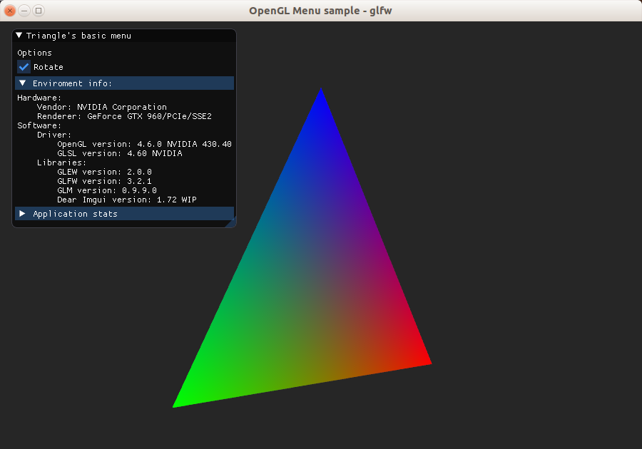

# Dear Imgui example using glfw

A minimal working example of an OpenGL program that uses [Dear imgui](http://github.com/ocornut/imgui) to implement a user menu. The sample uses [GLEW](http://glew.sourceforge.net/) as an extension loader, [GLM](http://glm.g-truc.net/) for the mathematics and [glfw](http://www.glfw.org/) as window manager.

Note that the code is written in a way to prefer clarity in presentation over performance in the execution or good codding patterns.

All the *sample* code is in a single [source file](glfwImgui.cpp). However, the Dear imgui requires several additional files, those are contained in the `imgui` folder. Imgui files were taken from the library [website](http://github.com/ocornut/imgui) and are not modified. Therefore you can always replace them with newer versions of the same files.

I tested the sample in an Ubuntu 18.04 standard installation. It also requires your graphics drivers already installed. And then, I installed all the libraries from the official repositories.

I provide a sample [makefile](Makefile) that works on the environment described above. For other platforms or IDEs you can deduct what you need to do by reading it.