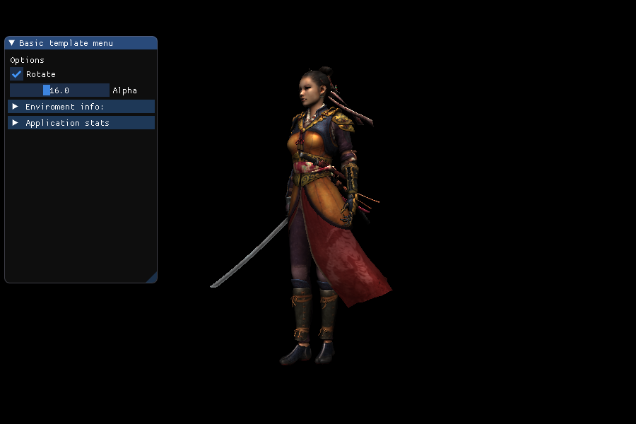
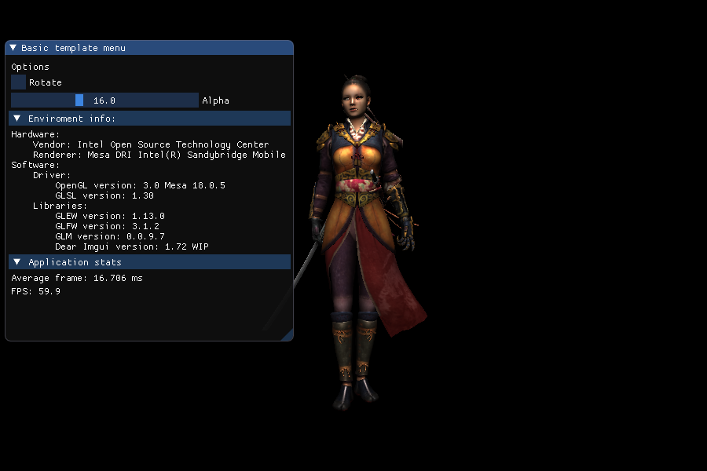

# OpenGL template

A template for the intermediate OpenGL programmer-user

The template requires an intermediate level [OpenGL](http://www.opengl.org/) user. You can use it as base for a homework or final project in an OpenGL course.

The template is composed of several files in their corresponding folders. Ideally, you will only need to change/adapt the files in the base directory: `main.cpp`, `commons.{h,cpp}`, `callbacks.{h,cpp}`.

## Features

* Several helper classes to handle common OpenGL related tasks.
* A trackball camera class.
* Go into full-screen mode.
* Take/save screen-shoots.
* An user menu
* Query for the version of the libraries and the OpenGL context.
* An already made connection to the OpenGL debug logger extension.

## Usage

The template requires working installation of the following libraries

* [GLEW](http://glew.sourceforge.net/) as extension loader.
* [GLFW](http://www.glfw.org/) as window manager.
* [GLM](https://glm.g-truc.net) as a math library.
* [FreeImage](http://freeimage.sourceforge.net/) as image read/write library.
* [Assimp](http://www.assimp.org/) as 3D model read/write library.
* [Dear Imgui](https://github.com/ocornut/imgui) for creating the UI menus. (Does not require install, all files are provided).

I tested in Ubuntu 14.04 and 18.04 by installing the libraries from the corresponding official repositories. In such scenarios the [Makefile](Makefile) works as it is. If you are in a different platform and/or environment, you should be able to deduct what you need to do just by seeing the makefile.

I also tested with success in both: a very old machine with Mesa Drivers only capable of OpenGL 3.0,
and in a very recent machine with latest Nvidia drivers (OpenGL 4.6).