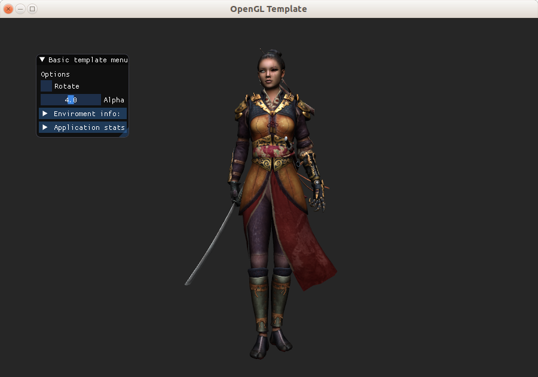
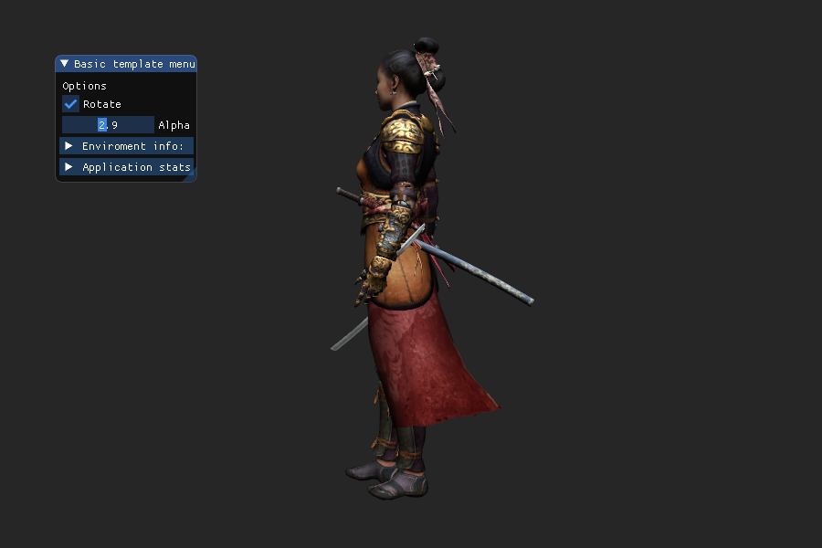

# OpenGL template

A template for the intermediate OpenGL programmer-user

The template requires an intermediate level [OpenGL](http://www.opengl.org/) user. You can use it as base for a homework or final project in an OpenGL course.



## Usage

The template is composed of several files in their corresponding folders.
All the independent classes are in their corresponding folders, ideally you can reuse them without modifications.

The teamplate parts that you need to adapt to each specific project are in the base folder. Ideally, you will only need to change/adapt the application class. In other words you usually only need to make changes in `main.cpp`, `templateApplication.{h,cpp}`, `menu.cpp`, and `callbacks.{h,cpp}`.

## Features

* Several helper classes to handle common OpenGL related tasks.
* A trackball camera class.
* Go into full-screen mode.
* Take/save screen-shoots.
* An user menu
* Query for the version of the libraries and the OpenGL context.
* An already made connection to the OpenGL debug logger extension.
* Classes to load/save meshes and images from file in several formats.




## Install

The template requires working installation of the following libraries

* [GLEW](http://glew.sourceforge.net/) as extension loader.
* [GLFW](http://www.glfw.org/) as window manager.
* [GLM](https://glm.g-truc.net) as a math library.
* [FreeImage](http://freeimage.sourceforge.net/) as image read/write library.
* [Assimp](http://www.assimp.org/) as 3D model read/write library.
* [Dear Imgui](https://github.com/ocornut/imgui) for creating the UI menus. (Does not require install, all files are provided).

Before trying to use/compile the template it's a good idea to have your graphics driver up to date.

I tested in Ubuntu 14.04 and 18.04 by installing the libraries from the corresponding official repositories.

```
sudo apt-get update
sudo apt-get install libglew-dev libglfw3-dev libfreeimage-dev libglm-dev libfreeimage-dev libfreeimageplus-dev libassimp-dev build-essential
```

In such scenarios the [Makefile](Makefile) works as it is. If you are in a different platform and/or environment, you should be able to deduct what you need to do just by seeing the makefile.

I tested with a model from [here](http://www.cgtrader.com/free-3d-models/character/woman/nyra-game-model).

I also tested with success in both: a very old machine with Mesa Drivers only capable of OpenGL 3.0,
and in a very recent machine with latest Nvidia drivers (OpenGL 4.6).