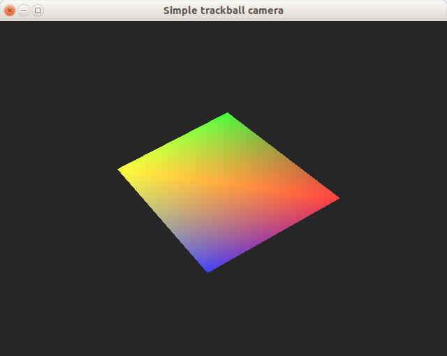

# Trackball camera sample

A minimal working example of a trackball camera in OpenGL.

Note that the code is written in a way to prefer clarity in presentation over performance in the execution or good codding patterns. The implementation is based in the theory descibed in this [article](https://www.khronos.org/opengl/wiki/Object_Mouse_Trackball)

* All the camera related code is encapsulated in a class.
* A single [main](main.cpp) file that shows how to use the class.

I tested the sample in an Ubuntu 18.04 standard installation. It also requires your graphics drivers already installed. And then, I installed all the libraries from the official repositories.

I provide a sample [makefile](Makefile) that works on the environment described above. For other platforms or IDEs you can deduct what you need to do by reading it.